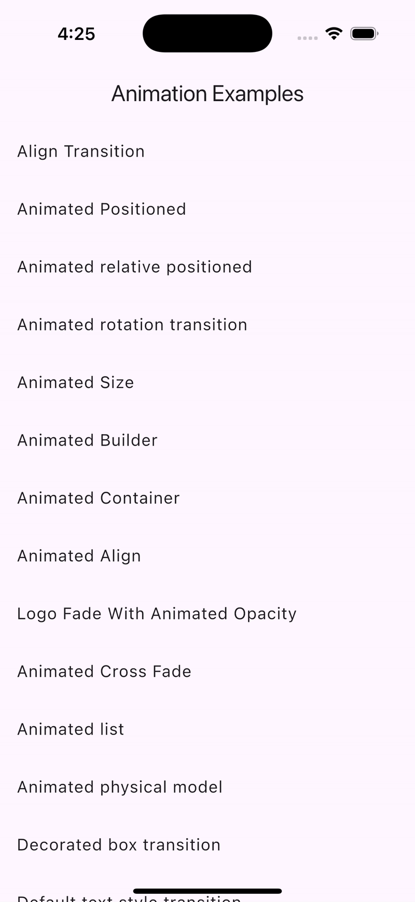

# Flutter Animations Example

A comprehensive collection of Flutter animation implementations demonstrating various animation techniques and widgets available in the Flutter framework.


## Demo

Watch the app in action:



## Features

This project showcases 21 different animation examples in Flutter:

1. **Align Transition** - Animates the alignment of a widget
2. **Animated Positioned** - Animates the position of a child within a Stack
3. **Animated Relative Positioned** - Animates the relative position of a child
4. **Animated Rotation Transition** - Animates the rotation of a widget
5. **Animated Size** - Automatically transitions its size over a given duration
6. **Animated Builder** - Creates a widget that animates using a custom Tween
7. **Animated Container** - Container that gradually changes its values over time
8. **Animated Align** - Animated version of the Align widget
9. **Logo Fade With Animated Opacity** - Demonstrates fading with opacity changes
10. **Animated Cross Fade** - Cross-fades between two given children
11. **Animated List** - Scrolling container that animates items when added or removed
12. **Animated Physical Model** - Animated version of PhysicalModel
13. **Decorated Box Transition** - Animates the decoration of a box
14. **Default Text Style Transition** - Animates changes in text style
15. **Hero Animation** - Shared element transitions between routes
16. **Matrix Transition** - Advanced animations using transformation matrices
17. **Scale Transition** - Animates the scale of a widget
18. **Size Transition** - Animates its own size and clips its child
19. **Staggered Animation** - Coordinated sequential animations
20. **Staggered Drawer Menu** - Staggered animation applied to a drawer menu
21. **Spotlight Example** - Custom spotlight highlight animation

## Getting Started

### Prerequisites
- Flutter SDK (latest stable version recommended)
- Dart SDK
- An IDE (Android Studio, VS Code, etc.)
- Git

### Installation

1. Clone the repository:
```bash
git clone https://github.com/user/flutter_animations_example.git
cd flutter_animations_example
```

2. Get dependencies:
```bash
flutter pub get
```

3. Run the app:
```bash
flutter run
```

## Usage

- Launch the app to see a list of all animation examples
- Tap on any animation to see it in action
- Each animation demonstration includes interactive elements to trigger and control the animation
- Study the implementation code to learn how each animation is built

## Project Structure

```
lib/
├── main.dart                        # Main application entry point
├── AnimationExamples.dart           # Main screen with list of all animations
└── animation_examples/              # Individual animation implementations
    ├── AlignTransition.dart
    ├── AnimatedAlign.dart
    ├── AnimatedBuilder.dart
    ├── ...
    ├── SpotLight/                   # Spotlight animation examples
    └── StaggerAnimation/            # Staggered animation examples
```

## Educational Value

This project serves as a practical reference for Flutter developers looking to implement animations in their own applications. Each example:

- Demonstrates a specific animation technique
- Shows proper implementation patterns
- Includes interactive elements to help understand the animation behavior
- Provides reusable code that can be adapted to your own projects

## Contributing

Contributions are welcome! Feel free to submit pull requests with additional animation examples or improvements to existing ones.

## License

This project is licensed under the MIT License - see the LICENSE file for details.

---

For help getting started with Flutter development, view the
[online documentation](https://docs.flutter.dev/), which offers tutorials,
samples, guidance on mobile development, and a full API reference.